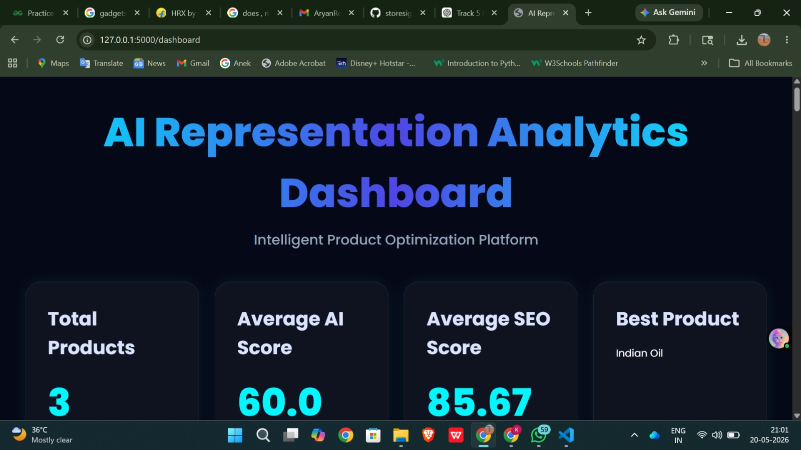
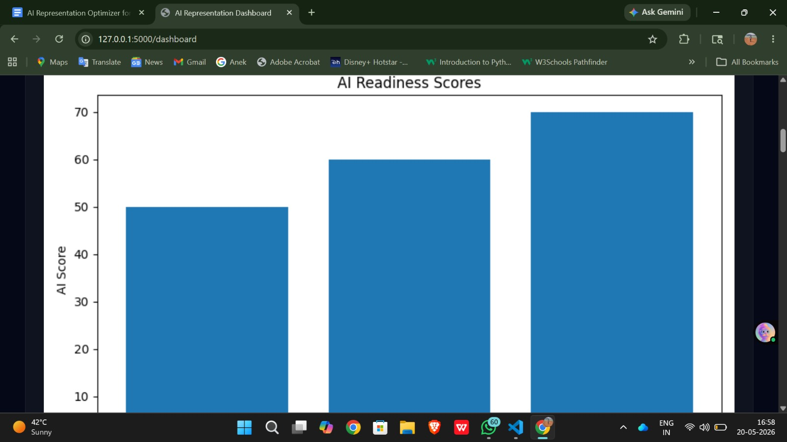
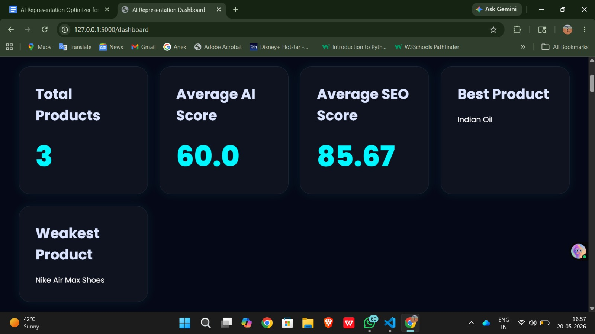
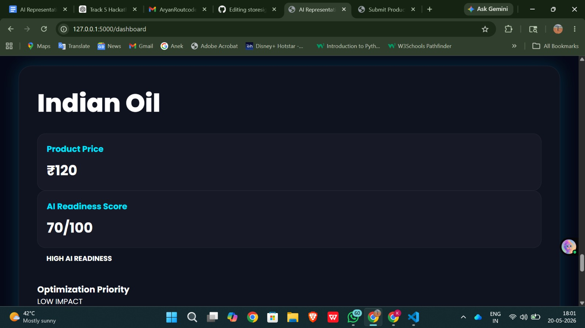

# StoreSignal 🔍
### Understand how AI shopping agents see your Shopify store. Fix gaps. Get recommended.

> **Kasparro Agentic Commerce Hackathon 2026 — Track 5: AI Representation Optimizer**

---

## The Problem

AI shopping agents (ChatGPT, Google AI, Perplexity) now recommend products directly inside conversations — without sending users to websites. These agents read store data: product descriptions, policies, reviews, and metadata. If that data is vague, incomplete, or contradictory, the AI either skips the merchant or misrepresents them.

**Merchants have zero visibility into how AI agents perceive them. StoreSignal fixes that.**

Many online product listings contain:
- Vague, non-specific descriptions
- Missing trust information and policies
- Weak semantic structure
- Poor SEO optimization
- Incomplete product metadata

StoreSignal solves this by analyzing product representation quality and generating intelligent optimization recommendations through a hybrid AI + deterministic architecture.

---

## What StoreSignal Does

StoreSignal is a merchant intelligence platform that:

1. **Diagnoses** — Analyzes how AI agents currently perceive the store
2. **Scores** — Generates AI Readiness Score and SEO Quality Score across key dimensions
3. **Detects** — Identifies ambiguity, missing information, and weak trust signals
4. **Explains** — Tells merchants exactly WHY they scored low, not just what the score is
5. **Recommends** — Generates ranked, actionable optimization suggestions

---

## Demo Video

▶️ [Watch the demo](https://drive.google.com/file/d/1oy3CgAnZLMQnR6nHkUV4JEl2OgvNSNld/view?usp=drivesdk)

---

## Screenshots

### AI Readiness Dashboard


### Product Analysis Screen


### KPI Analytics


### Recommendation Results


---

## How It Works

```
User Input (Product Data)
        ↓
Flask Backend
        ↓
Product Processing Engine
        ↓
Deterministic Audit          +          OpenAI Semantic Analysis
(missing fields, SEO,                   (ambiguity detection,
 KPI calculations,                       contextual reasoning,
 rule-based validation)                  recommendation generation)
        ↓
Hybrid Scoring Engine
(AI Readiness Score + SEO Score)
        ↓
Explainability Engine
(WHY did this score low?)
        ↓
Dashboard Visualization
(KPI cards, charts, ranked recommendations)
```

---

## Tech Stack

| Layer | Technology |
|---|---|
| Backend | Flask (Python) |
| Frontend | HTML, CSS, Jinja2 Templates |
| AI Layer | OpenAI API |
| Database | SQLAlchemy |
| Visualization | Matplotlib |
| Deployment | Render |
| Version Control | GitHub |

---

## AI vs Deterministic Logic

| Deterministic (Code Rules) | AI (OpenAI API) |
|---|---|
| Missing field detection | Ambiguity analysis |
| SEO score calculations | Semantic understanding |
| KPI score generation | AI recommendation generation |
| Rule-based validation | Contextual product evaluation |
| Dashboard analytics | Product optimization suggestions |

---

## Core Features

- **AI Readiness Scoring** — Overall store readiness for AI agent discovery
- **SEO Quality Evaluation** — How well products are structured for search
- **Ambiguity Detection Engine** — Flags vague, non-descriptive language
- **Explainable Analytics** — Reasoning behind every score
- **Best & Weakest Product Identification** — Know where to focus first
- **KPI-Based Insights** — Total products, average scores, performance trends
- **Smart Optimization Suggestions** — Ranked, actionable fixes

---

## Dashboard Metrics

The dashboard displays:
- Total Products Analyzed
- Average AI Readiness Score
- Average SEO Score
- Best Performing Product
- Weakest Product
- Product-Level Semantic Reports
- Optimization Suggestions per product

---

## Project Structure

```
storesignal/
│
├── app.py
├── config.py
├── requirements.txt
├── Procfile
├── README.md
├── DECISION_LOG.md
├── CONTRIBUTION.md
│
├── services/
│   ├── ambiguity_engine.py
│   ├── analytics_engine.py
│   ├── audit_engine.py
│   ├── explainability_engine.py
│   ├── openai_service.py
│   ├── scoring_engine.py
│   └── shopify_service.py
│
├── routes/
│   └── main_routes.py
│
├── database/
│   └── models.py
│
├── templates/
│   ├── dashboard.html
│   └── submit_product.html
│
├── static/
│   ├── charts/
│   └── css/
│       └── style.css
│
└── docs/
    ├── StoreSignal_Product_Document.pdf
    └── StoreSignal_Technical_Document.pdf
```

---

## Failure Handling

StoreSignal is designed for graceful degradation — no single failure crashes the system:

- **Invalid product data** — validated before processing, specific error messages shown
- **Missing descriptions** — flagged with exact word count and minimum recommendation
- **Empty field detection** — caught at input layer, never reaches analysis engine
- **OpenAI API failure** — deterministic scoring continues, default recommendations used
- **Chart generation failure** — dashboard still loads, KPI cards remain functional
- **Fallback scoring** — if AI layer fails, rule-based analysis produces valid results

---

## Setup Instructions

### Prerequisites
- Python 3.10+
- OpenAI API key
- Shopify Partner account (for store integration)

### Installation

```bash
# Clone the repo
git clone https://github.com/AryanRoutcode/storesignal.git
cd storesignal

# Create virtual environment
python -m venv venv

# Activate — Windows
venv\Scripts\activate

# Activate — Mac/Linux
source venv/bin/activate

# Install dependencies
pip install -r requirements.txt
```

### Environment Variables

Create a `.env` file in the root directory:

```
OPENAI_API_KEY=your_openai_key
SHOPIFY_API_KEY=your_shopify_key
SHOPIFY_API_SECRET=your_shopify_secret
SECRET_KEY=your_flask_secret_key
```

### Run the Application

```bash
python app.py
```

Open your browser at `http://localhost:5000`

---

## Future Improvements

- Multi-store analysis and comparison
- Real-time AI monitoring with alerts
- AI-generated product rewriting with one-click Shopify push
- Advanced product clustering
- Competitor benchmarking
- Exportable PDF analytics reports
- Multi-language optimization support

---

## Team

| Name | Role |
|---|---|
| Aryan Rout | Product Thinking, AI Workflow, Documentation, Demo Video |
| Sambhav Sahoo | Backend Development, Dashboard UI, Analytics Engine, Deployment |

---

## Submission

- **Hackathon:** Kasparro Agentic Commerce Hackathon 2026
- **Track:** Track 5 — AI Representation Optimizer
- **Deadline:** 20th May 2026, 11:59 PM IST
- **Demo Video:** [Link](https://drive.google.com/file/d/1oy3CgAnZLMQnR6nHkUV4JEl2OgvNSNld/view?usp=drivesdk)
- **GitHub:** [AryanRoutcode/storesignal](https://github.com/AryanRoutcode/storesignal)

---

## License

Developed for educational and hackathon purposes under the Kasparro Agentic Commerce Hackathon 2026.
